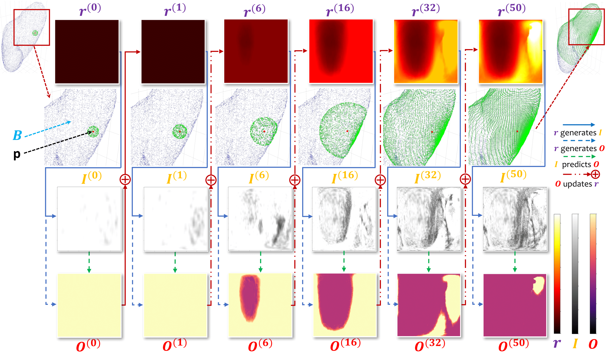

# Elastic Boundary Projection for 3D Medical Image Segmentation
This repository is PyTorch implementation for the paper: 

[Elastic Boundary Projection for 3D Medical Image Segmentation](https://arxiv.org/abs/1812.00518)<br>
Tianwei Ni<sup>1</sup>, Lingxi Xie<sup>2,3</sup>, Huangjie Zheng<sup>4</sup>, Elliot K. Fishman<sup>5</sup>, Alan L. Yuille<sup>2</sup><br>
<sup>1</sup>Peking University, <sup>2</sup>Johns Hopkins University, <sup>3</sup>Noah’s Ark Lab, Huawei Inc., <sup>4</sup>Shanghai Jiao Tong University, <sup>5</sup>Johns Hopkins Medical Institute<br>
In IEEE Conference on Computer Vision and Pattern Recognition **(CVPR)**, Long Beach, CA, USA, 2019.



## Dependencies
- Python 3.5+
- PyTorch 0.4+
- NumPy, SciPy, scikit-learn
- [NiBabel](https://nipy.org/nibabel/)
- [trimesh](https://github.com/mikedh/trimesh)
```bash
pip install -r requirements.txt # to install the packages above
```

- Disk Storage > 100G 
  - The generated dataset is very big due to large numbers of pivots. But the data generation process is pretty fast :)
- Testing Time > 1h per case 
  - 3D reconstruction, especially KDE and voxelization, is very slow. We will try to accelerate it in future work.
  
## Usage

### 1. Download Spleen Dataset
Due to the privacy of our medical dataset, here we provide a public dataset [MSD](http://medicaldecathlon.com/) for demonstration.

Please download and unzip the **spleen** part `Task09_Spleen.tar` of MSD dataset into your `$data_path` (please set it in `run.sh`). There are 41 training cases of spleen CT scans (the 20 testing cases are NOT open to the public). The shape of case is `(512,512,31~168)`. For MSD Spleen dataset, we simply split it in half, say the first 20 for testing and the last 21 for training. You can try other divisions of the dataset.

Set the switch `ENABLE_DATA_DOWNLOAD=1` in `run.sh`, and run it `sh run.sh` to reformat and split the dataset.

### 2. Data Generation
Set the switch `ENABLE_DATA_GENERATION=1` in `run.sh`, and run it to generate EBP's dataset. Make sure that your disk has enough space (> 100G).

>Details: according to the paper, for each pivot of each case, we will generate 2D (image, label) pairs with `(HEIGHT, WIDTH)` shape through `ITER_TH` iterations. In practice, `data_generation.py` will make a directory for each case, which is made up of `self.pivot_num` npy files named `XYDaaabbbcccp{0,1,2,3}.npy` of `(ITER_TH, self.slices + IN_SLICE + 2, HEIGHT, WIDTH) = (10, 12, 120, 120)` shape. In addition, it will also produce and save the important 3D matrix $C$ (`self.relabel`) which has the same shape as each case. <br>
>Notation: `D,X,Y` stand for $r,I,O$ respectively in the paper.
>`(aaa, bbb, ccc)` is the coordinate of pivot, and `{0,1,2,3}` is the kind of pivot defined in the program. <br>
>For more information, please see the Overall Framework (3.2), Data Preparation (3.3), and Data Generation (3.4) in the paper.

### 3. Training
Set the switch `ENABLE_TRAINING=1` in `run.sh`, and run it to train and validate the network. It costs about 12 GPU hours (multi-GPU will cause long IO latency).

>The decription of the 2D neural network (U/V-Net-like) can be seen in Experiments (4.1). `vnetg.py` will print training logs of the loss matrix `(4, ITER_TH)` per `period` iterations (here 4 means four kinds of pivots defined in `data_generation.py`). <br>
>As for criterion, we use Online Hard Example Mining (OHEM) for training and MSE for validation. We save the model snapshots of each epoch into `$data_path/models/dataset_organ$organ_id/vnetg*.pkl` and normally we choose the last one to test.

### 4. Testing
Set the switch `ENABLE_TESTING=1` and `TRAINING_TIMESTAMP` to refer to the snapshot model in `run.sh`.

Testing stage is a little complicated and pretty time-consuming because it involves the following steps:
- Iterations: `test_iter.py`
- 3D reconstruction: `test_voxel.py` which calls `test_util.py`

>In `test_iter.save_iteration_results()`, we save the binary matrix and other stuff for each case.
>Normally, `test_util.mesh3d()` costs much time. <br>
>For more information, please see the Testing: Iteration and Inference (3.5) and 3D Reconstruction (3.6) in the paper.

## Questions?
There may exist some minor typos in the codes because they are cleaned from original codes without complete tests. Welcome to open issues if you have any questions.

## Citation
If this work is useful for your research, please cite our paper:
```
@InProceedings{ni2019elastic,
  title={Elastic Boundary Projection for 3D Medical Image Segmentation},
  author={Ni, Tianwei and Xie, Lingxi and Zheng, Huangjie and Fishman, Elliot K and Yuille, Alan L},
  booktitle = {IEEE Conference on Computer Vision and Pattern Recognition},
  year={2019}
}
```

## Acknowledgments
This work was mainly done when the first author did a research internship at [CCVL](https://ccvl.jhu.edu/), Johns Hopkins University. We thank all the researchers at CCVL for their insightful discussions.<br>
This paper was supported by the Lustgarten Foundation for Pancreatic Cancer Research.
